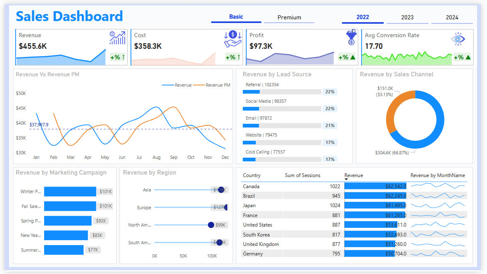
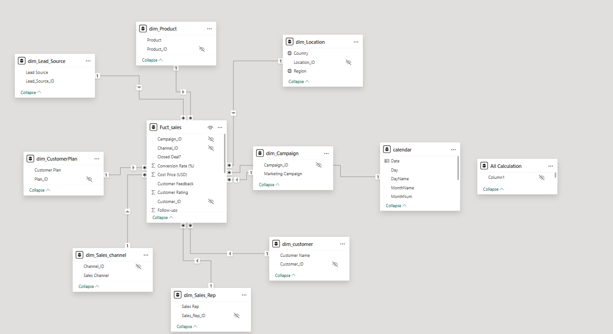

# Sales Marketing Report

This project is a **Sales & Marketing Report** built using Power BI.  
It showcases a complete transformation of raw transactional data into an optimized **Star Schema model** using data modeling best practices — primarily **Normalization and Denormalization** techniques.

---

## Table of Contents
- [Sales Marketing Report](#sales-marketing-report)
  - [Table of Contents](#table-of-contents)
  - [Overview](#overview)
  - [Objective](#objective)
  - [Data Modeling Approach](#data-modeling-approach)
  - [Dimension Tables](#dimension-tables)
  - [Why Normalization?](#why-normalization)
  - [Benefits Achieved](#benefits-achieved)
  - [Tools Used](#tools-used)
  - [Preview](#preview)
  - [License](#license)
  - [Contact](#contact)

---

## Overview

The raw data provided was a **single flat fact table**, containing all sales transactions with repeated fields for products, customers, regions, and sales reps. This flat structure posed performance and scalability issues in analysis.

To resolve this, I designed a normalized data model to convert the flat table into a **Star Schema**, enabling efficient analytics and better visualization in Power BI.

---

## Objective

- Improve data performance and manageability.
- Enable dynamic slicing and dicing across multiple sales dimensions.
- Create a professional, responsive Power BI dashboard.
- Apply real-world data modeling concepts to enhance Business Intelligence outputs.

---

## Data Modeling Approach

I applied **Normalization** to break the transactional table into multiple **Dimension Tables**, each representing a specific entity in the sales process.

The result is a **Star Schema** with a central `Fact_Sales` table surrounded by dimension tables connected via keys.

---

## Dimension Tables

Here are the main dimension tables created from the original dataset:

- `Dim_Product`
- `Dim_Customer`
- `Dim_Location`
- `Dim_Sales_Channel`
- `Dim_Sales_Rep`
- `Dim_Date`
- `Dim_Promotion` *(if applicable)*

Each table contains **unique, non-redundant values** for its category and is related back to the `Fact_Sales` table.

---

## Why Normalization?

The original flat table contained high redundancy — the same product names, customer info, and regions repeated across thousands of rows. This design:

- Slows down performance
- Makes updates difficult
- Creates risk of inconsistencies

Through normalization:
- Data became **organized and reusable**
- Relationships became **explicit and meaningful**
- The model became **scalable and efficient**

---

## Benefits Achieved

- **Faster loading & processing** in Power BI
- **Reduced storage and duplication**
- **Clear relationships** between business entities
- **Ease of maintaining and updating** the model
- **Enhanced slicing/filtering** using Slicers, Drill-downs, and DAX measures

---

## Tools Used

- Power BI (Desktop)
- Power Query (for data transformation)
- DAX (for measures and KPIs)
- Excel (initial data review)

---

## Preview

Below is a sample view of the data model used in this project:

---
> [!NOTE]  
✅ This project is a **hands-on case study in business data modeling** using **Power BI and star schema architecture**.  
✅ The data is **synthetic** and serves as a training example for BI concepts.  
✅ The model was created by transforming a flat fact table into a normalized structure to enable efficient analysis.  

---

> [!TIP]  
> Use **Date filters**, **Sales Channels**, and **Product slicers** in the dashboard to explore different views.  
> Incorporate **DAX time intelligence functions** for advanced KPIs.  
> You can also expand the model by adding **Forecasting**, **Budget comparisons**, or **Market segmentation**.

---

> [!WARNING]  
> **This project is for educational and portfolio demonstration purposes only.**  
> The data used does not represent any real company or actual business transactions.

---

> [!CAUTION]  
- Avoid treating this dataset as real-world financial data.  
- All business logic and relationships are **designed for illustration only**.  
- For production-level dashboards, always ensure **data governance**, **source validation**, and **user testing**.

## License

This project is for educational and portfolio purposes.  
Feel free to use the structure as inspiration, but give credit where due.

---

## Contact

For questions or collaboration opportunities, connect with me on [LinkedIn](linkedin.com/in/mohammed-ahmed-052769239).

